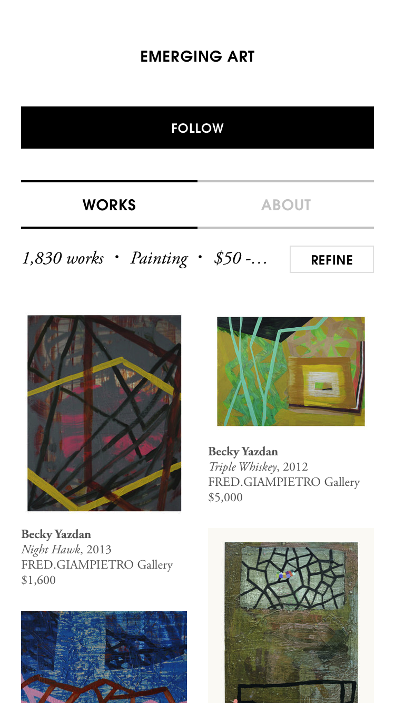
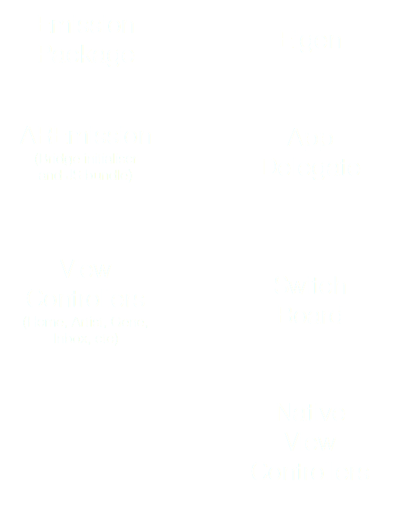
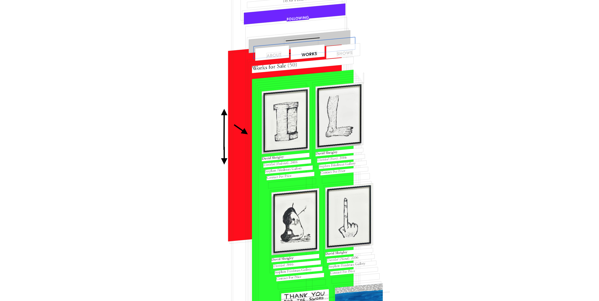

text: #FFFFFF
background-color: #6E1FFF

## Integrating React Native into an existing native codebase

### @alloy - artsy.net

^ 1. Our experience
2. Why and how

----


^ 1. Many dogs

----

# [fit] ME

----

## Eloy “Durán” Durán
## @alloy

^ I’m Eloy Durán, you may know me as @alloy

----

## Ruby dev since 2004
## Mac dev since 2006
## iOS dev since 2009

----

## RubyCocoa
## MacRuby
## RubyMotion

^ 1. Worked on alt langs

----

## CocoaPods
### 2010 - 2015

^ 1. Started CP
2. Like Yarn
3. iOS/Mac/ATV

----

## React Native
### since valentine’s day 2016 :heart:

^ 1. Started tests with 0.19
2. I’m a romantic

----

## Xcode
## survivor

^ 1. Goes off familiar/safe path

----

# [fit] Artsy

----

## Make all the world’s art
## accessible to anyone
## with an Internet
## connection

----

## Open-Source
## By Default

^ 1. We don’t ask “should this be open”
2. All client code is OSS

----

## “Eigen”
## Native iOS app since 2012


^ 1. Codenames based in science
2. Mobile projects start with ‘E’
3. I took lead in 2015

----

## “Emission”
## React Native iOS views
## since April 2016

----

# [fit] Why?

^ 1. realised we were chasing web parity
2. always behind
3. ‘open’ background and working with different stacks
4. what could future look like away from UIKit?

----

## Simpler mental model

^ 1. 5 years of MVC
2. 2 years of MVVM
3. codebase with tech debt
4. hard to onboard
5. hard to iterate
6. al-dente spaghetti

----

### [fit] Spaghetti code


^ 1. all code in same lang/runtime
2. easy to take shortcuts for deadlines, because “SHIP IT!”
3. reality is shortcuts would stay
4. singletons that get used everywhere
5. and from various threads
6. lack of constraints to keep us in check
7. as aside, cat looks excited to eat dog

----

### [fit] New paradigm


^ 1. looking for fresh new paradigm
2. contain state per view
3. not think about updating views
4. or concurreny (in view code)
5. aka React

----

## Networking

^ 1. app is JSON viewer
2. only works with network
3. has to work with bad networks (fairs)

----

### [fit] Request waterfall


^ 1. so also want efficient networking
2. our stack wasn’t bad
3. but a typical REST one
4. have to make multiple requests

----

### [fit] GraphQL


^ 1. web team started GraphQL service
2. facade around REST APIs
3. GraphQL is ideal for clients
4. only fetch data we need
5. ideally 1 request
6. yeah that’s not a tree, but deal with it

----

### [fit] GraphQL


^ …also with the glasses being flipped incorrectly.

----

## De-silo people

^ 1. as lead/manager
2. want people to work across platforms
3. not multiple people implementing same feature

----

### [fit] Pair up


^ 1. devs are not excited about re-implementing
2. it’s a waste of time
3. pair people
4. go through design process together
5. implement features across platforms
6. reached point where ‘web’ devs work on mobile app

----

## Improve developer experience

^ 1. devs should be happy and productive
2. big diffs are
3. compile and relaunch time
4. RN and HMR, even full reloads, are fast
5. native could take 20 sec on fast mac
6. want to fix bugs/limitations in frameworks
7. improve own workflow
8. hard with closed source like Xcode

----

## Expand platform support

^ 1. how about expanding platforms?
2. native experience chasing web was bad
3. won’t even think about expanding
4. but we want to…

----

### [fit] Android


^ 1. Android app overdue
2. React/RN allows us to work same on iOS and web
3. code re-use is nice, but not most important
4. love react mantra: “learn once, write anywhere”
5. related to de-siloeing, don’t want full android team
6. or yet other team for other platform, and so on
7. instead some people with deep platform experience
8. then apply same de-siloeing principles
9. actually, 1 team member during hackathon, tested emission on Android
10. results are pretty amazing

----




^ Here’s the iOS version of some of our React Native views.

----


^ 1. fonts aren’t right
2. little layout issues
3. like price on home artwork not aligned
4. missing tab view, which is native
5. but all in all promising

----

## Swift

^ 1. what about Swift?
2. we considered it
3. make our own React/Relay
4. could have done it, we have Swift experience
5. eidolon is full swift and OSS

----

### [fit] Optimized


^ 1. amazingly optimized lang
2. better choice than JS, right?
3. our app does no heavy processing
4. mostly layout and ‘glue’ code
5. if we ever need performance
6. we can do it with native modules

----

### [fit] Developer
### [fit] experience


^ 1. experience is: Swift is not right for us
2. biggest reasons:
3. compile times upto 30 sec on fast mac
4. libs had to be dynamic, longer startup time
5. maintain code for new Swift versions
6. problems will go away
7. but we needed something then/now
8. in this context not the right choice for DX

----

### [fit] Just a
### [fit] language


^ 1. Finally, just a lang
2. doesn’t help achieve goals
3. we didn’t choose RN because we love JS ;)
4. just a pragmatic choice
5. actually we use TS

----

## Summary

* Simpler mental model
* Simpler and more efficient networking
* De-silo people
* Improve developer experience
* Expand platform support

^ React, React Native, and Relay tick all of those boxes for us.

----

# [fit] How?

^ Alright, let’s dive into some details we had to deal with.

----

## Integration

^ 1. actual integration
2. didn’t want to change workflow for native devs
3. while I worked on initial Emission version
4. instead made RN an implementation detail
5. chose to do RN work in different project
6. Eigen imports as CP dep
7. like it does other deps

----

### [fit] Package



----

### [fit] Pros


^ 1. faster onboarding for both projects
2. eigen/oss devs don’t deal with e.g. npm
3. emission/oss devs don’t deal with many native app issues
4. add dev tooling without adding noise
5. like the Emission example app, which you’ll see soon
6. separation of CIs
7. easier for ‘web’ devs to review code
8. side-effect is we can re-use views, e.g. shows app

----

### [fit] Cons


^ 1. where do I file issue?
2. harder to test dev changes in app
3. more release work
4. more infra to weekly test builds
5. some duplication to show host app integrations
6. Eigen needs to extend VCs
7. e.g. to hook into scrolling to show/hide nav buttons

----

## Routing

^ 1. app uses URL based routing
2. we have existing engine called switch board
3. created native module
4. passes URLs to callback
5. main app uses callback to pass URL to switch board

----

### [fit] Mixed


^ 1. here we route through native and RN views
2. even a webview
3. nav solutions at the time didn’t offer this

----

### JavaScript API usage

```javascript
class Artwork extends React.Component {
  handleTap() {
    SwitchBoard.presentNavigationViewController(this, this.props.artwork.href)
  }

  // ...
}

class SearchBar extends React.Component {
  handleTap() {
    Switchboard.presentModalViewController(this, "/search")
  }

  // ...
}
```

^ 1. JS API is simple
2. now there are more complete solutions
3. we’d consider those, as long as they are native backed

----

### Objective-C API usage

```objc
@implementation AREmissionSetup

- (void)configureEmissionInstance:(AREmission *)emission;
{
  emission.switchBoardModule.presentNavigationViewController = ^(UIViewController * _Nonnull fromViewController,
                                                                 NSString * _Nonnull route) {
    [fromViewController.navigationController pushViewController:[self viewControllerForRoute:route]
                                                       animated:YES];
  };

  emission.switchBoardModule.presentModalViewController = ^(UIViewController * _Nonnull fromViewController,
                                                            NSString * _Nonnull route) {
    UIViewController *viewController = [self viewControllerForRoute:route];
    UINavigationController *navigationController = [self navigationControllerWithRootViewController:viewController];
    [fromViewController.navigationController presentViewController:navigationController animated:YES completion:nil];
  };
}

// ...

@end
```

----

## Nested scroll views

^ 1. in our designs
2. we have scrolling components
3. nested in other scrolling components
4. we want events to paginate
5. we wanted this to work transperantly in JS
6. RN doesn’t support this
7. we used objc’s dynamic nature to monkey-patch RCTScrollView

----

### [fit] Demo time


^ 1. pray to demo gods
2. show artist view
3. show tabs in 1 outer scrollview
4. add red bg to outer
5. add green bg to inner
6. add blue bg to 2nd inner

----

### [fit] Event forwarding



^ What happens is that a `RCTScrollView` instance, when mounted, checks if it’s enclosed by another `RCTScrollView` in the `UIView` hierarchy. If so, it registers for scroll notifications from the enclosing scroll view, and when it receives those, it generates an event object with coordinate data that’s _offset_ relative to the enclosing scroll view, meaning that the JavaScript `ScrollView` component receives and processes events like it normally would.

^ 1. scrollview on mount checks hierarchy
2. registers for scroll notifications
3. translates coordinates of events
4. JS scoll component processes like it normally would

----

## Optimized image view

^ 1. app is image heavy
2. we want optimized image component

----

### [fit] Shared caching


^ 1. eigen has cache
2. image component uses SDWebImage
3. at runtime they share cache

----

### [fit] Opaque drawing


^ 1. RN image component is generic and supports transperancy
2. art is not transperant
3. drawing into opaque bitmap context is more effifient
4. when the view hierarchy gets composited

----

# [fit] Conclusions

----

* Works well for us in production
* …but you should expect native work
* …however it does mean you can do anything
* Or you’re fine if you’ll adjust design based on limitations
* Bugs will be on _you_ to fix

^ 1. Apple loves us, so ok, I guess?

----

### [fit] @alloy
### [fit] artsy.net/rn-eu-links


