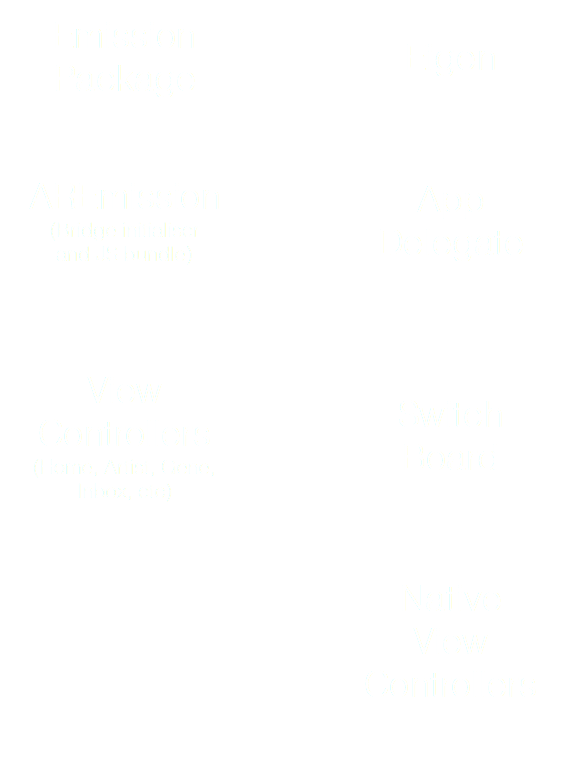
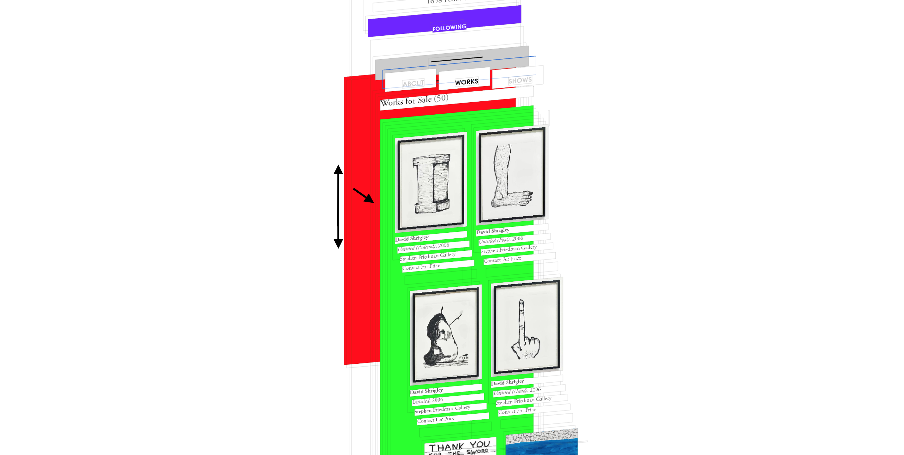

text: #FFFFFF
background-color: #6E1FFF

## Integrating React Native into an existing native codebase

### @alloy - artsy.net

^ Hi! In this talk I will tell you about our experience adopting React Native into our existing native codebase, why we chose to do so, and how we did it. Also, to offset the amount of cat pics your brain has to endure, there will be dogs…

----


^ …many, many, many dogs. Ok, on to the fun part, let’s talk about ME!

----

# [fit] ME

----

## Eloy Durán
## @alloy

^ I’m Eloy Durán, you may know me as @alloy

----

## Mac dev since 2006
## iOS dev since 2009

^ I’ve been a developer in the Apple ecosystem since 2006 (Mac dev) and iOS since 2009.

----

## RubyCocoa
## MacRuby
## RubyMotion

^ During that time I also worked on alternative language solutions for these platforms, all based on the Ruby language.

----

## CocoaPods
### 2010 - 2015

^ In addition, I started a project called ‘CocoaPods’, which some of you that have native experience may know. It’s a dependency manager much like Yarn (because we don’t host packages like npm does), except for iOS/Mac/Apple TV libaries.

----

## React Native
### since valentine’s day 2016 :heart:

^ Started experimentation with RN v0.19.0 to see what it felt like and if it met our expectations. Yeah, you can tell I’m a hopeless romantic.

----

## Xcode
## survivor

^ You could say that I’m not necessarily known for staying on the familiar and safe path.

----

# [fit] Artsy

----

## Make all the world’s art
## accessible to anyone
## with an Internet
## connection

----

## Open-Source
## By Default

^ We’re open-source by default, meaning that we don’t default to closed and ask ourselves “should this be open”, but rather default to open and ask ourselves “should this be closed”. All of our client apps code are available on GitHub.

----

## “Eigen”
## Native iOS app since 2012


^ In 2012 we started on our native iOS app, which has the codename Eigen. All our codenames are based in sience and the mobile related projects all start with an ‘E’. I took over as dev lead in 2015.

----

## “Emission”
## React Native iOS views
## since April 2016

----

# [fit] Why?

^ So why did we decide to switch to React Native? 2 years ago, we realised that we were always chasing web parity and were always lagging behind by quite some time, rather than being able to lead in any way. Coming from an ‘open’ background and being used to using different stacks, we set out to investigate what our future _could_ look like if we’d deviate from the blessed UIKit path.

----

## Simpler mental model

^After having accumulated 5 years of MVC (and some MVVM) code, our code base had become hard for people to on-board on and hard for everybody to iterate on. It had essentially become a mess of tough to grok al-dente spaghetti code.

----

### [fit] Spaghetti code


^ When patterns such as MVC are loosely enforced and all code lives inside the same runtime, it is easy to make some shortcuts here and there, you know how it goes (“SHIP IT! (we’ll cleanup afterwards)”), but in reality (some of) these stop-gap solutions remain and now you have a code-base that has some singletons that are called from models, controllers, and views, and often from various threads. In short, there’s a lack of constraints that could keep us in check.

^ Also, that cat is looking suspiciously delighted at the prospect of eating spaghetti with dog.

----

### [fit] New paradigm


^ In short, we were looking for a new paradigm, something fresh, that would nicely contain state per view component and where we would not have to think about how to update views or about things like concurrency (when writing view code, that is). A.k.a. React.

----

## Networking

^ Our application is basically a ‘JSON viewer’. It relies entirely on backend data to be able to do its work and often it has to do its work under bad network conditions, such as at an art fair.

----

### [fit] Request waterfall


^ As such, we wanted to take this opportunity to also consider a more efficient way to fetch data for our use case. Our networking stack wasn’t necessarily inefficient, but it was a very typical REST one, meaning that we’d often have to make multiple requests before we could fully render a view.

----

### [fit] GraphQL


^ Luck would have it that our –then still separate– web-team had decided to start using GraphQL and created a facade GraphQL service around our REST APIs. As you probably all know, GraphQL is ideal for clients like ours because it allows us to only fetch the data we need and, in ideal circumstances, _all of it_ in 1 request.

^ And yeah, that’s not a tree, but honestly… deal with it.

----

### [fit] GraphQL


^ …also with the glasses being flipped incorrectly.

----

## De-silo people

^ Another important consideration for me, as dev lead of a mobile _and_ web team, was that I would prefer it if people could work on the same features across platforms, rather than having different people implement the same features on distinct platforms.

----

### [fit] Pair up


^ Developers generally don’t get very excited from the prospect of redoing something that others have already done before them, and tbh it’s just a waste of time and brain cycles. Instead, people with different platform knowledge would ideally team up and go through the design process together and then implement the same features for both platforms.

^ And we do that now, we have ‘web’ people working on React Native components, where last year they had no idea at all that they’d be doing that this year.

----

## Improve developer experience

TODO Add GIFs?

^ We want developers to be happy and more productive. One big difference can be made in compile and relaunch time. As you all know, with React Native and things like HMR, but even full reloads, this is ridiculously fast compared to the native code cycle you get with Xcode, which could easily take 20 seconds on a fast mac.

^ When we run into bugs or limitations in the frameworks we use, we prefer to be able to fix those problems, rather than having to work around them, if that’s possible at all.

^ Additionally we also like to improve our own workflows, which is hard with a closed-source product like Xcode.

----

## Expand platform support

^ And what about expanding onto new platforms? With the amount of time it took us to chase parity with the web, I wouldn’t even want to think about expanding onto other platforms right now.

^ But we do want to…

----

### [fit] Android


^ An Android app is way overdue and with React Native we’ll be able to at least _work_ the same way we’ve been learning to work on iOS and web. Code re-use is an important factor, but not the biggest one; I really love the React mantra that goes “learn once, write anywhere”.

^ Related to de-siloeing was the consideration that we ideally wouldn’t want to have a completely new Android team. It doesn’t scale well. Instead I’d prefer to have a few people with deep understanding of the platform and then apply the same principles so we can form one large team

^ As a matter of fact, one of my team members during a recent Artsy hackathon spent some time to see how well our existing React Native codebase would run on Android. The results are pretty amazing.

----


^ Here’s the iOS version of some of our React Native views.

----


^ And here’s the Android versions.

^ The fonts aren’t quite right yet, there’s some little layout issues (like the price on the home view not being aligned with the rest of the metadata), and it’s missing the tab view which is a native component that we already had and has a nice transition animation.

^ All in all, it’s looking promising and we’re starting to create a road map toward full Android support.

----

## Swift

^ So what about Swift? We often get asked why we chose React Native instead. Well, we didn’t do so lightly, we did consider to implement React and Relay like libraries in Swift. In fact, when Swift was released we were one of the first companies to open-source an app completely done in Swift, called Eidolon.

----

### [fit] Optimized


^ Swift is an amazingly optimized language, surely you would want to use that over interpreted JavaScript, right?

^ Well, in our app we’re not doing any heavy processing of any sorts, the code is mostly just layout and ‘glue’ code. And honestly, if we ever do need to run some code that would benefit from being native and optimized, we can still do that with React Native through native modules.

----

### [fit] Developer
### [fit] experience


^ And our experience unfortunately taught us that Swift was not yet ready for our liking. There were various reasons, with the biggest being that compile times would be even longer than our Objective-C code (upto 30 sec on a fast mac), libraries had to be linked as dynamic libraries leading to longer startup time, and having to update our code everytime a new Swift version was released.

^ It’s important to note that these problems will likely go away over time, however we needed to make a choice _then_ and at the time it didn’t improve our DX.

----

### [fit] Just a
### [fit] language


^ Finally, and most importantly; Swift is _just another_ language, it doesn’t help us in any way to achieve the aforementioned goals that using React and Relay would offer us.

^ Honestly, we didn’t choose React Native because we’re such big fans of JavaScript ;)

----

## Summary

* Simpler mental model
* Simpler and more efficient networking
* De-silo people
* Improve developer experience
* Expand platform support

^ React, React Native, and Relay tick all of those boxes for us.

----

# [fit] How?

^ Alright, let’s dive into some details we had to deal with.

----

## Integration

^ First of all, the actual integration. We didn’t want to force everybody that worked on the native app to immediately have to deal with fallout of any sorts, instead we wanted the React Native code to be an implementation detail and have devs be able to continue to work in the exact way they had before. Thus we decided to do our React Native development inside a different repository and publish the compiled production-ready code as a CocoaPods dependency.

----

### [fit] Package



----

### [fit] Pros


^ * Faster to setup, build, and launch than Eigen
* Eigen _and_ external OSS devs don’t need to faff with npm
* All code in repo is related to React Native dev
* We can add tooling to improve our React Native DX without adding noise to Eigen’s repo, such as an example app that’s solely focussed on dev
* Separation of testing infrastructure, Eigen and Emission have their own CI setup
* Allows ‘web’ devs to review code without having to navigate the larger native codebase
* As a side-effect, we would now be able to pull this package into other apps that need the same views but are for instance focussed on art shows in your neighbourhood.

----

### [fit] Cons


^ * Where do I file this issue?
* Harder to test local changes in the context of the larger app
* More release work
* Because there was more release work we had to setup weekly automated builds to ease testing
* To be able to showcase code that has native integrations, there needs to be some duplication in the example dev app.
* In Eigen we need to extend Emission’s Objective-C view controller classes to add certain Eigen specific details such as the navigation button hiding/showing when scrolling.

----

## Routing

^ Like many apps, our app shows views based on routes. We had to tie into our existing native code for this, so we created a native module that would pass URLs to a native callback. The main app could then specify a callback that would take that URL and pass it to the routing engine, which we call ‘switch board’.

----

### [fit] Mixed


^ Here we go from a React Native view, to a fully native view, to another React Native view, to a fully native view, another React Native view, another fully native view, and finally even a webview.

^ This is something that the available navigation solutions at the time couldn’t do and some also didn’t ‘feel’ native to the platform.

----

### JavaScript API usage

```javascript
class Artwork extends React.Component {
  handleTap() {
    SwitchBoard.presentNavigationViewController(this, this.props.artwork.href)
  }

  // ...
}

class SearchBar extends React.Component {
  handleTap() {
    Switchboard.presentModalViewController(this, "/search")
  }

  // ...
}
```

^ The React API for this is pretty simple. Nowadays there are more complete solutions available that we would consider, as long as they use native navigation APIs so they act and feel how users expect them to.

----

### Objective-C API usage

```objc
@implementation AREmissionSetup

- (void)configureEmissionInstance:(AREmission *)emission;
{
  emission.switchBoardModule.presentNavigationViewController = ^(UIViewController * _Nonnull fromViewController,
                                                                 NSString * _Nonnull route) {
    [fromViewController.navigationController pushViewController:[self viewControllerForRoute:route]
                                                       animated:YES];
  };

  emission.switchBoardModule.presentModalViewController = ^(UIViewController * _Nonnull fromViewController,
                                                            NSString * _Nonnull route) {
    UIViewController *viewController = [self viewControllerForRoute:route];
    UINavigationController *navigationController = [self navigationControllerWithRootViewController:viewController];
    [fromViewController.navigationController presentViewController:navigationController animated:YES completion:nil];
  };
}

// ...

@end
```

----

## Nested scroll views

^ In our designs, we had situations where otherwise standalone scroll-y components could exist inside other scroll views, but we still wanted those components to be able to receive scroll events such as `onEndReached` so that they could paginate. However, we didn’t want to make those nested scroll views ‘aware’ of this detail, instead we wanted to be able to nest them and have things working as expected transperantly.

^ This is not something that React Native supports out of the box and also not something that’s easily achievable from JavaScript. Instead, we opted to use the Objective-C runtime’s dynamic nature to monkey-patch `RCTScrollView` to add support for it.

----

### [fit] Demo time


^ Let’s hope the demo gods are happy today.

^ Show artist view as normal and show that all tabs exist in an outer scrollview. Then add red BG color to outer scrollview, and page artworks 1 page, then add green BG color to first inner scrollview, and page till end, then show that there’s another scrollview and by coloring it blue and page till end.

----

### [fit] Event forwarding



^ What happens is that a `RCTScrollView` instance, when mounted, checks if it’s enclosed by another `RCTScrollView` in the `UIView` hierarchy. If so, it registers for scroll notifications from the enclosing scroll view, and when it receives those, it generates an event object with coordinate data that’s _offset_ relative to the enclosing scroll view, meaning that the JavaScript `ScrollView` component receives and processes events like it normally would.

----

## Optimized image view

^ Because our app is so image heavy, there were a couple of optimizations we wanted to have that the React Native provided image component can’t do for us.

----

### [fit] Shared caching


^ We have a ‘SDWebImage’ cache in place for all images that the native app fetches. We obviously wanted to make use of the same cache in our React Native code, so our custom image component uses the same APIs and cache instance that the native app uses.

----

### [fit] Opaque drawing


^ Finally, in order to be generic and support transperant images, the React Native default image component didn’t draw into an opaque bitmap context. However, in our case we have no images with transperancy _at all_, thus drawing into an opaque bitmap context would gain us some performance when the view hierarchy gets composited.

----

# [fit] Conclusions

----

* Works well for us in production
* …but you should expect native work
* …however it does mean you can do anything
* Bugs will be on _you_ to fix

^ Apple loves us.

----

### [fit] @alloy
### [fit] artsy.net/rn-eu-links


